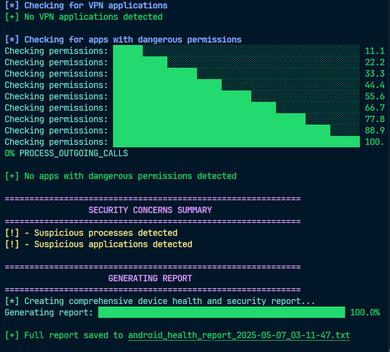

# Android Device Health & Security Check


A comprehensive tool for checking the health and security status of your Android device. This tool provides detailed information about your device's performance, installed applications, and potential security issues.

## 📸 Screenshots


_Main screen showing device health information_


_Security analysis results_

> **Note:** To use this tool, you'll need to connect your Android device via USB with debugging enabled.

## 🌟 Features

- **Colorful Console Output**: Beautiful and easy-to-read terminal output with color-coded information
- **Device Health Metrics**: CPU usage, memory information, battery stats, and more
- **App Analysis**: Complete list of installed applications with security analysis
- **Security Checks**:
  - Root detection
  - Suspicious process identification
  - Network connection analysis
  - VPN application detection
  - Dangerous permission analysis
- **Comprehensive Reports**: Saves detailed reports to files for future reference
- **Progress Indicators**: Visual progress bars for long-running operations

## 📋 Requirements

- Python 3.6 or higher
- Android Debug Bridge (ADB) installed and in your PATH
- An Android device with USB debugging enabled

## 🚀 Installation

1. Ensure you have Python 3.6+ installed
2. Install Android Debug Bridge (ADB) if not already installed:
   - Download from [Android Platform Tools](https://developer.android.com/studio/releases/platform-tools)
   - Add the ADB executable to your system PATH
3. Clone or download this repository
4. Connect your Android device via USB and enable USB debugging

## 📱 Enabling USB Debugging

1. Go to **Settings** > **About phone**
2. Tap **Build number** 7 times to enable Developer options
3. Go back to **Settings** > **System** > **Developer options**
4. Enable **USB debugging**
5. Connect your device to your computer and authorize the connection when prompted

## 💻 Usage

Run the script from the command line:

```bash
python android_health_check.py
```

The tool will:

1. Check for ADB installation
2. Connect to your Android device
3. Collect health and security information
4. Display results in the console with color-coded sections
5. Save a comprehensive report to a timestamped file
6. Save the complete list of installed apps to a separate file

## 📊 Output Files

The tool generates two output files:

1. **android*health_report*[timestamp].txt**: A comprehensive report containing all collected information
2. **installed_apps.txt**: A complete list of all installed applications on the device

## 🔍 Security Analysis

The security analysis includes:

- **Root Detection**: Checks if the device is rooted
- **Process Analysis**: Identifies potentially suspicious running processes
- **Network Analysis**: Checks for suspicious network connections
- **VPN Detection**: Identifies VPN applications
- **Permission Analysis**: Checks for apps with dangerous permissions
- **App Analysis**: Scans app names for suspicious keywords

## 🛠️ Troubleshooting

### ADB Not Found

If ADB is not found in your PATH, the tool will prompt you to enter the full path to the ADB executable. You can:

1. Add ADB to your system PATH
2. Enter the full path when prompted
3. Modify the `ADB_PATH` variable in the script

### Device Not Detected

If your device is not detected:

1. Ensure USB debugging is enabled
2. Check the USB connection
3. Authorize the computer on your device if prompted
4. Try a different USB cable or port

## 📝 License

This project is licensed under the MIT License - see the LICENSE file for details.

## 🤝 Contributing

Contributions, issues, and feature requests are welcome! Feel free to check the issues page.

## 📧 Contact

For any questions or suggestions, please open an issue on the repository.

## 🔄 Git Setup

If you want to clone this repository or contribute, you can use the following Git commands:

```bash
# Clone the repository
git clone https://github.com/RaheesAhmed/Android-Device-Security-Checker.git

# Navigate to the project directory
cd Android-Device-Security-Checker

# Create a new branch for your changes
git checkout -b feature/your-feature-name

# Make your changes and commit them
git add .
git commit -m "Add your descriptive commit message here"

# Push your changes to GitHub
git push origin feature/your-feature-name
```

If you're setting up a new repository with this code:

```bash
# Initialize a new Git repository
git init

# Add all files to the repository
git add .

# Commit the files
git commit -m "Initial commit: Android Device Security Checker"

# Set the main branch
git branch -M main

# Add the remote repository
git remote add origin https://github.com/YourUsername/Your-Repository-Name.git

# Push to GitHub
git push -u origin main
```

---

Made with ❤️ for Android enthusiasts and security-conscious users
